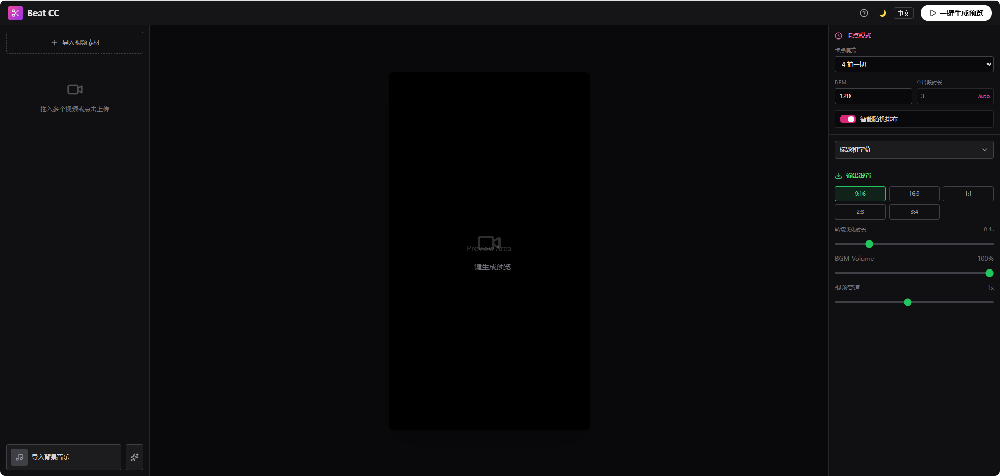

# 适用于节奏卡点、视频混剪的自动混剪工具

    This contains everything you need to run your app locally.
    This software is free to use for personal, non-commercial purposes only.
    
    本软件仅供个人非商业用途使用。
    未经作者书面许可，严禁任何商业用途（包括但不限于销售软件、 在商业产品中使用或用于商业运营）。

--------
# 通过beatCC自动剪辑.bat启动应用
常见问题救急 (FAQ)

    Q1: 我点了导出 MP4，但是没反应 / 报错了？
    -原因-：可能是第一次环境没配好，或者电脑缺组件。
    -解决-：
    1.  去文件夹里找 -`配置环境.bat`-，双击运行一次，页面显示完成后再试。
    2.  如果还是不行，软件会自动退而求其次给你下载 -WebM- 格式。WebM 也是视频，用播放器都能看，发 B 站/抖音也支持。

    Q2: 生成视频一直卡在 99% 或 100% 转圈？
    -解决-：这通常是因为浏览器在处理大文件。请耐心多等 10 秒。如果 1 分钟了还没动静，刷新网页重来一次（记得尽量不要用那种几小时长的 4K 电影当素材）。

    Q3: 为什么下载的视频没有声音？
    -解决-：请检查你导入的音乐文件是否正常。另外，iPhone 拍摄的某些特殊格式视频偶尔会有兼容性问题，建议用常见的 MP4 视频素材。

    Q4: 那个“黑窗口”关掉了怎么办？
    -解决-：网页会因为连不上服务而报错。你需要重新双击 `beatCC自动剪辑.exe` 再次启动它。

    Q5: 启动失败，出现错误？
    -解决-：双击“环境配置.bat”，安装环境。
